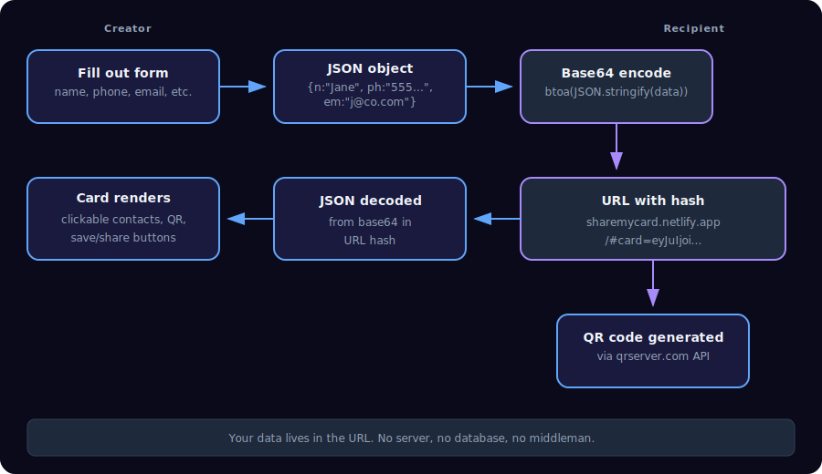
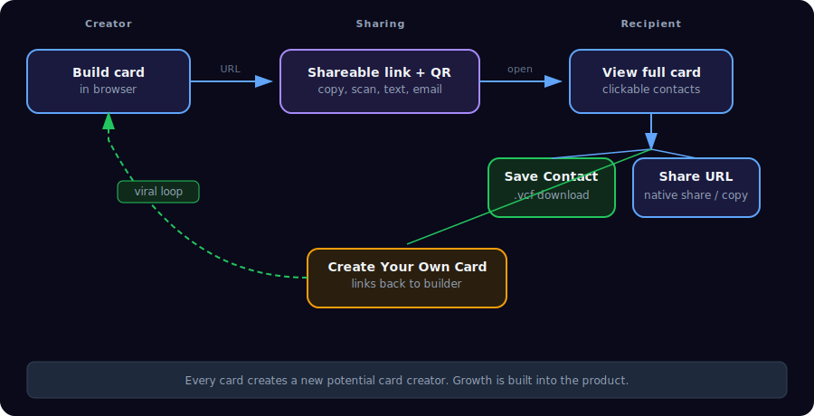
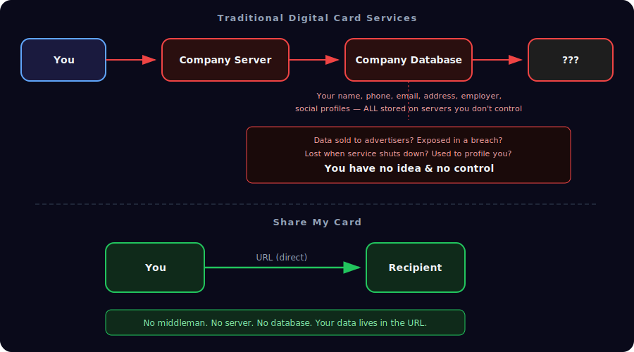
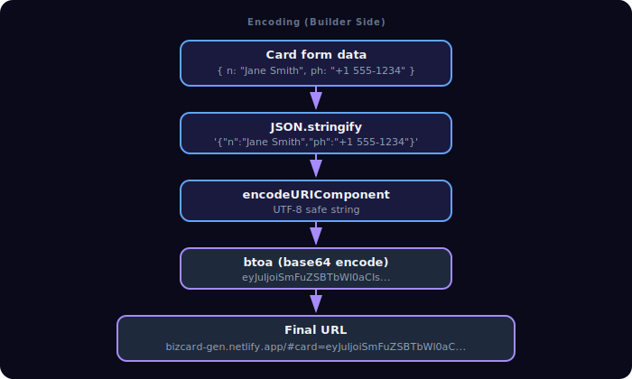
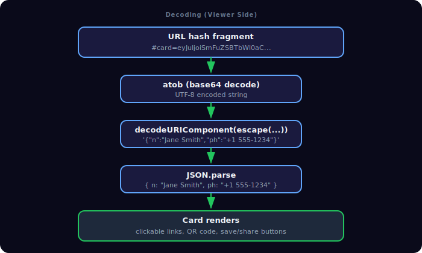

# Share My Card

**Free, open-source digital business cards. No accounts. No servers. No one else touching your data.**

[Try it now](https://sharemycard.netlify.app) -- [See an example card](https://stuart-kerr-card.netlify.app)

---

## The Problem

**Physical business cards are broken.** They cost money to print, can't be updated, end up in a drawer, and eventually hit the trash. That cycle has always been wasteful.

**Digital alternatives aren't much better.** Services like Popl, HiHello, and Linktree fix the paper problem but introduce a worse one: they collect and store all of your personal contact information on their servers. You hand over your phone number, email, address, social profiles, and employer to a company you have no relationship with. That data can be sold, breached, or lost when the service shuts down. Many of them charge monthly fees on top of it.

**Share My Card takes a different approach.** Your data never leaves your browser. There is no backend, no database, no account, and no company sitting between you and the person you share your card with.

---

## How It Works

Share My Card is a single HTML file that runs entirely in your browser. It operates in two modes:

**Builder mode** -- You fill out a form with your name, title, company, contact details, social links, photos, and brand colors. A live phone-frame preview updates as you type.

**Viewer mode** -- When someone opens a Share My Card URL, the app reads the card data directly from the URL hash, decodes it, and renders the full card with clickable contact links, a QR code, and action buttons.

The key insight: your card data is the URL. Nothing is stored anywhere else.

---

## Data Flow



<details>
<summary>ASCII Version (for AI/accessibility)</summary>

```
 CREATOR                                                    RECIPIENT
 -------                                                    ---------

 +------------------+     +------------------+     +--------------------+
 |  Fill out form   | --> |  JSON object     | --> |  Base64 encode     |
 |  (name, phone,   |     |  {n:"Jane",      |     |  btoa(JSON.stringify|
 |   email, etc.)   |     |   ph:"555-1234", |     |   (cardData))      |
 +------------------+     |   em:"j@co.com"} |     +--------------------+
                          +------------------+               |
                                                             v
 +------------------+     +------------------+     +--------------------+
 |  Card renders    | <-- |  JSON decoded    | <-- |  URL with hash     |
 |  with clickable  |     |  from base64     |     |  bizcard-gen.      |
 |  contacts, QR,   |     |  in URL hash     |     |  netlify.app       |
 |  save/share btns |     +------------------+     |  /#card=eyJuIjoi...|
 +------------------+                              +--------------------+
                                                             |
                                                             v
                                                   +--------------------+
                                                   |  QR code generated |
                                                   |  via qrserver.com  |
                                                   |  API (encodes the  |
                                                   |  full card URL)    |
                                                   +--------------------+
```

</details>

---

## Sharing Flow



<details>
<summary>ASCII Version (for AI/accessibility)</summary>

```
  CREATOR                        SHARING                         RECIPIENT
  -------                        -------                         ---------

  +-------------+    URL     +----------------+    open URL    +----------------+
  |  Build card | ---------> |  Shareable     | ------------> |  View full     |
  |  in browser |            |  link + QR     |               |  card          |
  +-------------+            +----------------+               +----------------+
                                    |                                |
                              QR code scan                     +-----+-----+
                              text / email                     |     |     |
                              social media                     v     v     v
                                                            Save  Share  Create
                                                           Contact  URL  Your Own
                                                            (.vcf)       Card
                                                                          |
                                                                          v
                                                                   +------------+
                                                                   | New user   |
                                                                   | builds     |
                                                                   | their own  |
                                                                   | card       |
                                                                   | (viral     |
                                                                   |  loop)     |
                                                                   +------------+
```

</details>

---

## Privacy: Share My Card vs. Traditional Services



<details>
<summary>ASCII Version (for AI/accessibility)</summary>

```
  TRADITIONAL DIGITAL CARD SERVICES
  ----------------------------------

  +------+     +------------------+     +------------------+     +--------+
  | You  | --> | Company's Server | --> | Company Database | --> |   ???  |
  +------+     +------------------+     +------------------+     +--------+
                                               |
     Your name, phone, email,                  |  Data sold to advertisers?
     address, employer, social                 |  Exposed in a breach?
     profiles -- ALL stored on                 |  Lost when service shuts down?
     servers you don't control                 |  Used to build a profile on you?
                                               v
                                        +-------------+
                                        | You have no |
                                        | idea & no   |
                                        | control     |
                                        +-------------+


  BIZCARD
  -------

  +------+          URL          +-----------+
  | You  | --------------------> | Recipient |
  +------+                       +-----------+

  That's it. No middleman. No server. No database.
  Your data lives in the URL and nowhere else.
```

</details>

---

## Features

### Card Builder
- **Live preview** -- see your card update in real time inside a phone-frame mockup
- **Profile photo, banner image, company logo** -- upload files or provide URLs
- **Custom accent colors** -- two-color gradient for banner and buttons
- **Contact fields** -- phone, email, WhatsApp, website, address
- **Social links** -- LinkedIn, Twitter/X, calendar booking, custom extra link
- **Bio section** -- short description displayed on the card

### Sharing and Export
- **Shareable URL** -- one click generates a link with all card data encoded in the hash
- **QR code** -- auto-generated, downloadable as a PNG for print or digital use
- **Downloadable standalone HTML** -- a complete self-contained card file you can host anywhere
- **VCF contact file** -- recipients can save your info directly to their phone contacts
- **Native share** -- uses the Web Share API on supported devices (iOS, Android)

### Viral Growth
- **"Create Your Own Card" button** -- every viewed card links back to the builder
- **Free, no signup required** -- zero friction for new users

---

## Technical Details

| Aspect | Detail |
|---|---|
| **Stack** | Pure HTML, CSS, and JavaScript. No frameworks. No dependencies. No build step. |
| **Architecture** | Single `index.html` file (~730 lines). Two modes controlled by URL hash presence. |
| **Data encoding** | `JSON` -> `encodeURIComponent` -> `btoa` -> URL hash fragment (`#card=eyJ...`) |
| **Data decoding** | `atob` -> `escape` -> `decodeURIComponent` -> `JSON.parse` |
| **QR generation** | [qrserver.com](https://goqr.me/api/) free API (no key required) |
| **VCF format** | vCard 3.0 with support for name, title, org, phone, email, URL, social profiles, address, and photo URI |
| **Hosting** | Netlify static hosting. Any static host works (GitHub Pages, Vercel, S3, your own server). |
| **Responsive** | Mobile-first CSS grid layout. Builder uses two-column layout on desktop, single column on mobile. |

### File Structure

```
BizCard/
  index.html          Main application (builder + viewer)
  contact-card/
    create.html        Legacy standalone card builder
  netlify.toml         Netlify deployment config (publish from root)
  .gitignore           Ignores .netlify local folder
```

---

## Getting Started

### Use it online (no setup)

Go to **[sharemycard.netlify.app](https://sharemycard.netlify.app)** and start building your card.

### Run it locally

```bash
git clone https://github.com/stuinfla/BizCard.git
cd BizCard
```

Open `index.html` in any browser. That's it. There is no install step, no `npm install`, no build process.

If you want a local server (for testing shareable links):

```bash
# Python 3
python3 -m http.server 8000

# Node.js (if you have npx)
npx serve .
```

Then visit `http://localhost:8000`.

### Deploy your own instance

Share My Card is a static site. Deploy it anywhere:

**Netlify** -- connect your GitHub repo, set publish directory to `.`, done.

**GitHub Pages** -- push to a `gh-pages` branch or enable Pages on `main`.

**Vercel** -- import the repo, deploy with zero configuration.

**Any web server** -- copy `index.html` to your server's public directory.

---

## Usage

### Creating a card

1. Open the builder at [sharemycard.netlify.app](https://sharemycard.netlify.app)
2. Fill in your details (name, title, company, contact info, socials)
3. Upload or link a profile photo, banner image, and company logo
4. Pick your brand colors using the color pickers
5. Watch the live preview update as you type

### Generating a shareable link

1. Click **"Generate Shareable Link"**
2. A URL and QR code appear below the form
3. Click **"Copy"** to copy the URL to your clipboard
4. Click **"Download QR Image"** to save the QR code as a PNG

### Downloading a standalone card

1. Click **"Download Card"** to save a self-contained HTML file
2. A VCF contact file is also downloaded automatically
3. Host the HTML file on any web server, or send it directly

### Sharing your card

- **Text or email** -- paste the shareable URL
- **In person** -- show the QR code on your phone for someone to scan
- **On your website** -- embed the QR code image or link to your card URL
- **Print** -- put the QR code on physical materials (business cards, flyers, name badges)

---

## How the URL Encoding Works

Share My Card stores card data in the URL hash fragment. The hash never gets sent to a server -- it stays entirely in the browser.

**Encoding (builder side):**



<details>
<summary>ASCII Version (for AI/accessibility)</summary>

```
Card form data
     |
     v
JavaScript object: { n: "Jane Smith", ph: "+1 555-1234", em: "jane@co.com", ... }
     |
     v
JSON.stringify  ->  '{"n":"Jane Smith","ph":"+1 555-1234","em":"jane@co.com"}'
     |
     v
encodeURIComponent (handle Unicode)  ->  UTF-8 safe string
     |
     v
btoa (base64 encode)  ->  eyJuIjoiSmFuZSBTbWl0aCIsInBoIjoiKzEgNTU1LT...
     |
     v
URL:  https://sharemycard.netlify.app/#card=eyJuIjoiSmFuZSBTbWl0aC...
```

</details>

**Decoding (viewer side):**



<details>
<summary>ASCII Version (for AI/accessibility)</summary>

```
URL hash: #card=eyJuIjoiSmFuZSBTbWl0aC...
     |
     v
atob (base64 decode)  ->  UTF-8 encoded string
     |
     v
decodeURIComponent(escape(...))  ->  '{"n":"Jane Smith","ph":"+1 555-1234",...}'
     |
     v
JSON.parse  ->  { n: "Jane Smith", ph: "+1 555-1234", em: "jane@co.com", ... }
     |
     v
Card renders with clickable links, QR code, and action buttons
```

</details>

Default color values (`#2563eb` and `#7c3aed`) are stripped during encoding to keep URLs shorter.

---

## Why Share My Card Exists

| | Physical Cards | Popl / HiHello / Linktree | **Share My Card** |
|---|---|---|---|
| **Cost** | $20-80+ per order | Free tier or $5-10/month | **Free forever** |
| **Updatable** | No (reprint required) | Yes | **Yes (generate new URL)** |
| **Privacy** | N/A | Your data on their servers | **Your data in the URL only** |
| **Account required** | No | Yes | **No** |
| **Works offline** | Yes (physical) | No | **Yes (downloaded HTML)** |
| **Self-hostable** | N/A | No | **Yes** |
| **Open source** | N/A | No | **Yes (MIT)** |
| **Dependencies** | Printer | Their platform | **A web browser** |
| **Data portability** | None | Platform lock-in | **It's a URL -- copy it anywhere** |

---

## Contributing

Share My Card is a single HTML file with no build tools. Contributing is straightforward:

1. Fork the repository
2. Edit `index.html`
3. Open it in a browser to test
4. Submit a pull request

There is no toolchain to set up, no packages to install, and no CI pipeline to fight with.

---

## Links

- **Builder**: [sharemycard.netlify.app](https://sharemycard.netlify.app)
- **Example card**: [stuart-kerr-card.netlify.app](https://stuart-kerr-card.netlify.app)
- **GitHub**: [github.com/stuinfla/BizCard](https://github.com/stuinfla/BizCard)

---

## License

MIT -- use it however you want. No attribution required.
